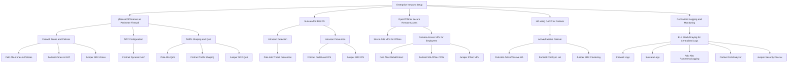

# CREATING_A_SECURE_ENTERPRISE_NETWORK

```mermaid
flowchart TD;

    A[Enterprise Network Setup] --> B[pfsense/OPNsense as Perimeter Firewall]
    A --> C[Suricata for IDS/IPS]
    A --> D[OpenVPN for Secure Remote Access]
    A --> E[HA using CARP for Failover]
    A --> F[Centralized Logging and Monitoring]

    B --> G[Firewall Zones and Policies]
    B --> H[NAT Configuration]
    G --> Z1[Palo Alto Zones & Policies]
    G --> Z2[Fortinet Zones & NAT]
    G --> Z3[Juniper SRX Zones]
    H --> Z4[Fortinet Dynamic NAT]
    
    C --> I[Intrusion Detection]
    C --> J[Intrusion Prevention]
    I --> Z5[Palo Alto Threat Prevention]
    J --> Z6[Fortinet FortiGuard IPS]
    J --> Z7[Juniper SRX IPS]
    
    D --> K[Remote Access VPN for Employees]
    D --> L[Site-to-Site VPN for Offices]
    K --> Z8[Palo Alto GlobalProtect]
    K --> Z9[Fortinet SSL/IPSec VPN]
    K --> Z10[Juniper IPSec VPN]
    
    E --> M[Active/Passive Failover]
    M --> Z11[Palo Alto Active/Passive HA]
    M --> Z12[Fortinet FortiSync HA]
    M --> Z13[Juniper SRX Clustering]

    F --> N[ELK Stack/Graylog for Centralized Logs]
    N --> O[Firewall Logs]
    N --> P[Suricata Logs]
    N --> Z14[Palo Alto Panorama/Logging]
    N --> Z15[Fortinet FortiAnalyzer]
    N --> Z16[Juniper Security Director]

    B --> Q[Traffic Shaping and QoS]
    Q --> Z17[Palo Alto QoS]
    Q --> Z18[Fortinet Traffic Shaping]
    Q --> Z19[Juniper SRX QoS]
```
