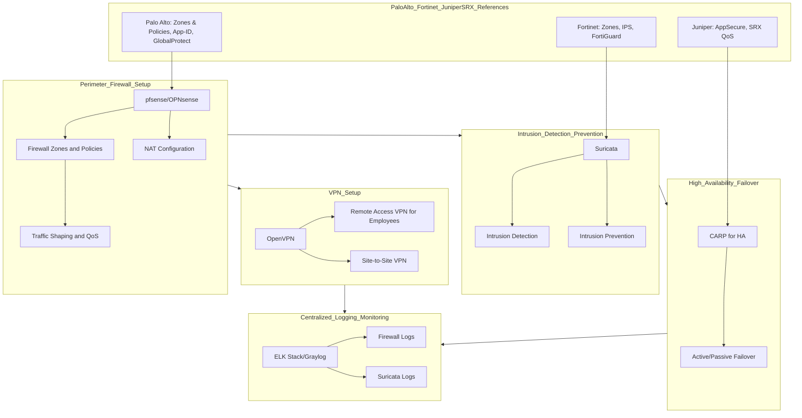

# CREATING_A_SECURE_ENTERPRISE_NETWORK

```mermaid
flowchart TD;

    %% Grouping the firewall functionalities under one subgraph
    subgraph Perimeter_Firewall_Setup
        A1[pfsense/OPNsense] --> B1[Firewall Zones and Policies]
        A1 --> C1[NAT Configuration]
        B1 --> D1[Traffic Shaping and QoS]
    end

    %% IDS/IPS section using Suricata
    subgraph Intrusion_Detection_Prevention
        A2[Suricata] --> B2[Intrusion Detection]
        A2 --> C2[Intrusion Prevention]
    end
    
    %% VPN and Remote Access section using OpenVPN
    subgraph VPN_Setup
        A3[OpenVPN] --> B3[Remote Access VPN for Employees]
        A3 --> C3[Site-to-Site VPN]
    end

    %% High Availability setup using CARP
    subgraph High_Availability_Failover
        A4[CARP for HA] --> B4[Active/Passive Failover]
    end
    
    %% Centralized logging and monitoring using ELK stack or Graylog
    subgraph Centralized_Logging_Monitoring
        A5[ELK Stack/Graylog] --> B5[Firewall Logs]
        A5 --> C5[Suricata Logs]
    end

    %% Connecting Components together
    Perimeter_Firewall_Setup --> Intrusion_Detection_Prevention
    Perimeter_Firewall_Setup --> VPN_Setup
    Intrusion_Detection_Prevention --> High_Availability_Failover
    VPN_Setup --> Centralized_Logging_Monitoring
    High_Availability_Failover --> Centralized_Logging_Monitoring

    %% Labeling references for proprietary solutions
    subgraph PaloAlto_Fortinet_JuniperSRX_References
        X1[Palo Alto: Zones & Policies, App-ID, GlobalProtect] --> A1
        X2[Fortinet: Zones, IPS, FortiGuard] --> A2
        X3[Juniper: AppSecure, SRX QoS] --> A4
    end
```
